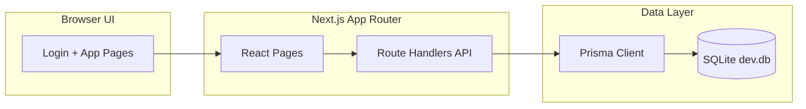

# FleetFlow
*Optimize, Track, and Manage Your Fleet in Real-Time*

FleetFlow is a rule-based fleet management system that replaces manual logbooks with a real-time command center for dispatching, safety, and finance.

## What You Get

- Role-ready login experience (demo mode)
- Command Center dashboard with KPIs
- Vehicle registry and lifecycle status controls
- Trip dispatch with cargo weight validation
- Maintenance logging that auto-removes vehicles from dispatch
- Expense and fuel logging
- Driver compliance and safety profiles
- Operational analytics with CSV export

## Tech Stack

- Next.js App Router + TypeScript
- Prisma + SQLite
- Tailwind CSS with custom design system

## Tech Highlights

- **Next.js App Router + TypeScript** for modular UI and API routes
- **Prisma + SQLite** for relational data and easy migrations
- **Tailwind CSS** for responsive, clean design
- **Mermaid.js** for architecture visualization
- **Role-based Access Control** for multi-role workflow

## Architecture

FleetFlow is a single Next.js app that serves the UI and API routes, with Prisma handling data access to SQLite.



## How It Works

1) The UI loads pages from the App Router and calls route handlers for data.
2) Route handlers validate business rules (capacity, license expiry, availability).
3) Prisma reads and writes to SQLite, updating vehicle and driver status in real time.
4) Analytics aggregates trip, expense, and maintenance data for KPIs and ROI.

## Data Model (Core)

- Vehicle: status, type, capacity, odometer, region, acquisition cost
- Driver: license compliance, status, safety score, completion rate
- Trip: lifecycle state, cargo, revenue, distance, driver, vehicle
- MaintenanceLog: service events that lock vehicle availability
- Expense: fuel and operational costs linked to vehicle/trip

## Features (Detailed)

- Role-ready login: demo role selection stored in local storage
- Command Center: live KPIs (active fleet, maintenance alerts, utilization, pending cargo)
- Vehicle Registry: add assets, manage capacity, toggle out-of-service
- Trip Dispatch: validates cargo vs capacity and license validity
- Trip Lifecycle: dispatched, completed, cancelled with availability updates
- Maintenance Logs: service records auto-set vehicle to in shop
- Expenses: log fuel and operational costs per vehicle
- Drivers: compliance checks, safety scores, duty toggles
- Analytics: fuel efficiency and ROI with CSV export

## Project Structure

```text
FleetFlow/
	prisma/
		schema.prisma
		seed.ts
		migrations/
	scripts/
		postinstall.cjs
	src/
		app/
			(app)/
				analytics/
				drivers/
				expenses/
				maintenance/
				trips/
				vehicles/
				layout.tsx
				page.tsx
			api/
				analytics/
				bootstrap/
				drivers/
				expenses/
				maintenance/
				trips/
				vehicles/
			login/
			globals.css
			layout.tsx
		components/
			Bootstrap.tsx
			SectionHeader.tsx
			Sidebar.tsx
			StatCard.tsx
			StatusPill.tsx
			TopBar.tsx
		lib/
			bootstrap.ts
			db.ts
			format.ts
	public/
	.env.example
	package.json
	README.md
```

## Quick Start

```bash
npm install
npm run prisma:generate
copy .env.example .env
npx prisma migrate dev --name init
npm run seed
npm run dev
```

Open http://localhost:3000 to view the Command Center.

## Quick Start (Hackathon Demo)

1. Clone repo: `git clone https://github.com/SabarishR08/FleetFlow.git`
2. Install dependencies: `npm install`
3. Generate Prisma client: `npm run prisma:generate`
4. Copy env: `copy .env.example .env`
5. Run migrations: `npx prisma migrate dev --name init`
6. Seed demo data: `npm run seed`
7. Start dev server: `npm run dev`
8. Open [http://localhost:3000](http://localhost:3000) in your browser

## Key Workflows

1) Add vehicle and driver
2) Dispatch trip (cargo weight validated)
3) Complete trip (odometer + availability updates)
4) Log maintenance (vehicle set to in shop)
5) Review analytics and export CSV

## Pages

- Login: demo-only role selection (RBAC-ready UI)
- Command Center: KPIs, active trips, maintenance radar
- Vehicle Registry: CRUD + lifecycle status toggles
- Trip Dispatch: cargo validation + status transitions
- Maintenance: service logging auto-sets in-shop status
- Expenses: fuel and operational cost logging
- Drivers: compliance checks and duty status
- Analytics: fuel efficiency and ROI with CSV export

## Business Rules

- Cargo weight cannot exceed vehicle capacity
- Driver with expired license cannot be dispatched
- Vehicle/driver set to On Trip when dispatched
- Completing or canceling a trip returns availability
- Maintenance log sets vehicle to In Shop

## Scripts

- `npm run dev` - start the app
- `npm run build` - production build
- `npm run start` - run production server
- `npm run prisma:migrate` - apply DB migrations
- `npm run seed` - seed demo data

## Environment

Create `.env` from the example:

```bash
copy .env.example .env
```

The default SQLite DB is `dev.db` in the project root.

## Next Steps / Bonus Features

- WebSocket-based real-time fleet updates
- Offline-first mode for low-connectivity areas
- PDF/Excel export for trips, expenses, and maintenance
- Role-specific dashboards with personalized KPIs
